<p align="center">
  
</p>

# 📓 Notebooked

**Transform Jupyter Notebooks into Production-Ready ML Pipelines**

Notebooked is a Python CLI tool that converts tagged Jupyter notebooks into production-ready training, inference, and deployment scripts for AWS SageMaker, Azure ML, and Google Cloud Vertex AI.

[](https://www.python.org/downloads/)
[](https://opensource.org/licenses/MIT)

---

## 🌟 Features

- **Multi-Cloud Support**: Deploy to AWS SageMaker, Azure ML, or Google Cloud Vertex AI
- **Automated Code Generation**: Convert notebooks to `train.py`, `inference.py`, and `preprocess.py`
- **Intelligent Parsing**: Extracts code using cell tags or auto-detection
- **MLFlow Integration**: Built-in experiment tracking and model versioning
- **CI/CD Ready**: Generate GitHub Actions workflows for automated deployment
- **Provider Agnostic**: Abstract interface for easy cloud provider switching
- **Auto-Dependency Detection**: Uses `pipreqs` to generate `requirements.txt`

---

## 🏗️ Architecture

### High-Level Overview


### Code Flow

```mermaid
sequenceDiagram
    participant User
    participant CLI
    participant Parser
    participant Generator
    participant Provider
    participant Cloud

    User->>CLI: notebooked convert my-experiment
    CLI->>Parser: parse_notebook()
    Parser->>Parser: extract_tagged_code()
    Parser-->>CLI: ExtractedCode
    CLI->>Generator: generate_all()
    Generator->>Generator: create train.py
    Generator->>Generator: create inference.py
    Generator->>Generator: create preprocess.py
    Generator-->>CLI: generated_files
    CLI-->>User: ✓ Scripts generated
    
    User->>CLI: notebooked train my-experiment --provider sagemaker
    CLI->>Provider: train()
    Provider->>Cloud: submit_training_job()
    Cloud-->>Provider: job_status
    Provider-->>User: ✓ Training complete
```



### Directory Structure

```
notebooked/
├── src/notebooked/
│   ├── core/
│   │   ├── parser.py          # Notebook parsing & tag extraction
│   │   ├── generator.py       # Script generation logic
│   │   ├── models.py          # Pydantic config models
│   │   ├── config.py          # Configuration management
│   │   └── workflow.py        # CI/CD workflow generation
│   ├── providers/
│   │   ├── base.py            # Abstract base provider
│   │   ├── local.py           # Local execution provider
│   │   ├── sagemaker.py       # AWS SageMaker provider
│   │   ├── azure_ml.py        # Azure ML provider
│   │   └── vertex_ai.py       # Google Cloud Vertex AI provider
│   └── cli.py                 # Click-based CLI
├── notebooks/                 # Example notebooks
├── tests/                     # Unit and integration tests
├── config.yaml                # Project configuration
└── pyproject.toml             # Project metadata & dependencies
```

---

## 🚀 Quick Start

### Installation

```bash
# Clone the repository
git clone https://github.com/yourusername/notebooked.git
cd notebooked

# Install in editable mode
pip install -e .

# For Azure support
pip install -e .[azure]

# For GCP support
pip install -e .[gcp]

# For development
pip install -e .[dev]
```

### Basic Usage

#### 1. Tag Your Notebook Cells

Add tags to your Jupyter notebook cells:

- `imports` - Import statements
- `preprocess` - Data preprocessing functions
- `model` - Model architecture classes
- `train` - Training functions and loops
- `inference` - Inference/prediction functions
- `utils` - Utility functions
- `requirements` - Manual requirements (optional)

**How to add tags in Jupyter:**
1. Click on a code cell
2. View → Cell Toolbar → Tags
3. Add appropriate tag(s)

#### 2. Initialize Configuration

```bash
notebooked init
```

This creates a `config.yaml`:

```yaml
mlflow:
  tracking_uri: "http://localhost:5000"
  experiment_name: "my-experiment"

aws:
  region: "us-east-1"
  role: "arn:aws:iam::123456789012:role/SageMakerRole"

azure:
  subscription_id: "your-subscription-id"
  resource_group: "your-resource-group"
  workspace_name: "your-workspace"

gcp:
  project_id: "your-project-id"
  location: "us-central1"
  staging_bucket: "gs://your-bucket"

experiments:
  - name: "anomaly-detection"
    notebook: "notebooks/anomaly_detection.ipynb"
    data_path: "s3://my-bucket/data"
    hyperparameters:
      epochs: 10
      learning_rate: 0.001
```

#### 3. Convert Notebook to Scripts

```bash
notebooked convert anomaly-detection
```

Generates:
- `generated/anomaly-detection/train.py`
- `generated/anomaly-detection/inference.py`
- `generated/anomaly-detection/preprocess.py`
- `generated/anomaly-detection/requirements.txt`

#### 4. Train Your Model

**Local:**
```bash
notebooked train anomaly-detection --provider local
```

**AWS SageMaker:**
```bash
notebooked train anomaly-detection --provider sagemaker
```

**Azure ML:**
```bash
notebooked train anomaly-detection --provider azure
```

**Google Cloud Vertex AI:**
```bash
notebooked train anomaly-detection --provider gcp
```

#### 5. Deploy Model

```bash
notebooked deploy anomaly-detection \
  --model-uri s3://my-bucket/model.tar.gz \
  --endpoint-name my-endpoint \
  --provider sagemaker
```

#### 6. Generate CI/CD Workflow

```bash
notebooked generate-workflow --provider sagemaker
```

Creates `.github/workflows/notebooked-pipeline.yml` for automated training and deployment.

---

## 📚 Detailed Documentation

### Cell Tags Reference

| Tag | Purpose | Required | Example |
|-----|---------|----------|---------|
| `imports` | Import statements | No* | `import torch` |
| `preprocess` | Data loading & preprocessing | No | `def load_data():` |
| `model` | Model architecture classes | No | `class MyModel(nn.Module):` |
| `train` | Training loop & logic | Yes | `def train_model():` |
| `inference` | Inference functions | Recommended | `def predict():` |
| `utils` | Helper functions | No | `def calculate_metric():` |
| `requirements` | Manual dependencies | No | `torch>=2.0` |

\* If not tagged, imports are auto-detected from the first few cells.

### Provider Configuration

Each provider requires specific configuration in `config.yaml`:

#### AWS SageMaker
- `region` - AWS region
- `role` - IAM role ARN with SageMaker permissions
- `instance_type` - Training instance type (default: ml.m5.xlarge)

#### Azure ML
- `subscription_id` - Azure subscription ID
- `resource_group` - Azure resource group name
- `workspace_name` - Azure ML workspace name

#### Google Cloud Vertex AI
- `project_id` - GCP project ID
- `location` - GCP region (e.g., us-central1)
- `staging_bucket` - GCS bucket for artifacts

### CLI Commands

```bash
# Initialize project
notebooked init

# Convert notebook to scripts
notebooked convert <experiment-name>

# Train model
notebooked train <experiment-name> [OPTIONS]
  --provider [local|sagemaker|azure|gcp]
  --wait/--no-wait

# Deploy model
notebooked deploy <experiment-name> [OPTIONS]
  --model-uri <uri>
  --endpoint-name <name>
  --serverless  # For serverless endpoints
  --provider [local|sagemaker|azure|gcp]

# Generate CI/CD workflow
notebooked generate-workflow [OPTIONS]
  --provider [local|sagemaker|azure|gcp]
  --branch <branch-name>
```

---

## 🔄 Workflow Examples

### End-to-End ML Pipeline


### CI/CD Integration


---

## 🧪 Testing

### Example: Anomaly Detection

We include a comprehensive example notebook demonstrating LSTM Autoencoders for ECG anomaly detection:

```bash
# Convert the example notebook
notebooked convert anomaly-detection

# Train locally
notebooked train anomaly-detection --provider local

# Train on SageMaker
notebooked train anomaly-detection --provider sagemaker --wait
```

The example demonstrates:
- Complex model architectures (Encoder, Decoder, Autoencoder)
- Data preprocessing with sequence generation
- MLFlow integration
- Best model checkpointing
- SageMaker-ready inference handlers

---

## 🤝 Contributing

See [CONTRIBUTING.md](CONTRIBUTING.md) for detailed guidelines.

**Quick Start:**
1. Fork the repository
2. Create a feature branch: `git checkout -b feature/amazing-feature`
3. Make your changes
4. Run tests: `pytest tests/`
5. Run linting: `ruff check src/`
6. Commit: `git commit -m 'Add amazing feature'`
7. Push: `git push origin feature/amazing-feature`
8. Open a Pull Request

---

## 📄 License

This project is licensed under the MIT License - see the [LICENSE](LICENSE) file for details.

---

## 🙏 Acknowledgments

- Inspired by MLOps best practices and the need for simpler notebook-to-production workflows
- Built with [Click](https://click.palletsprojects.com/) for CLI
- Uses [Pydantic](https://docs.pydantic.dev/) for configuration validation
- Powered by [MLflow](https://mlflow.org/) for experiment tracking

---

## 📞 Support

- **Issues**: [GitHub Issues](https://github.com/yourusername/notebooked/issues)
- **Discussions**: [GitHub Discussions](https://github.com/yourusername/notebooked/discussions)
- **Email**: your.email@example.com

---

**Made with ❤️ for the ML community**
