# Notebooked Architecture

This document provides a detailed technical overview of the Notebooked architecture, design patterns, and implementation details.

---

## System Architecture

### Component Diagram

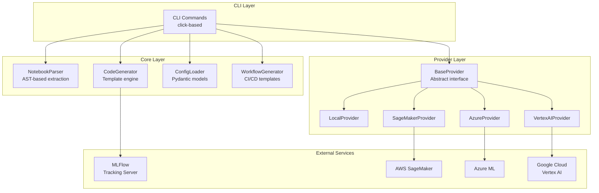

---

## Data Flow

### Notebook Conversion Flow

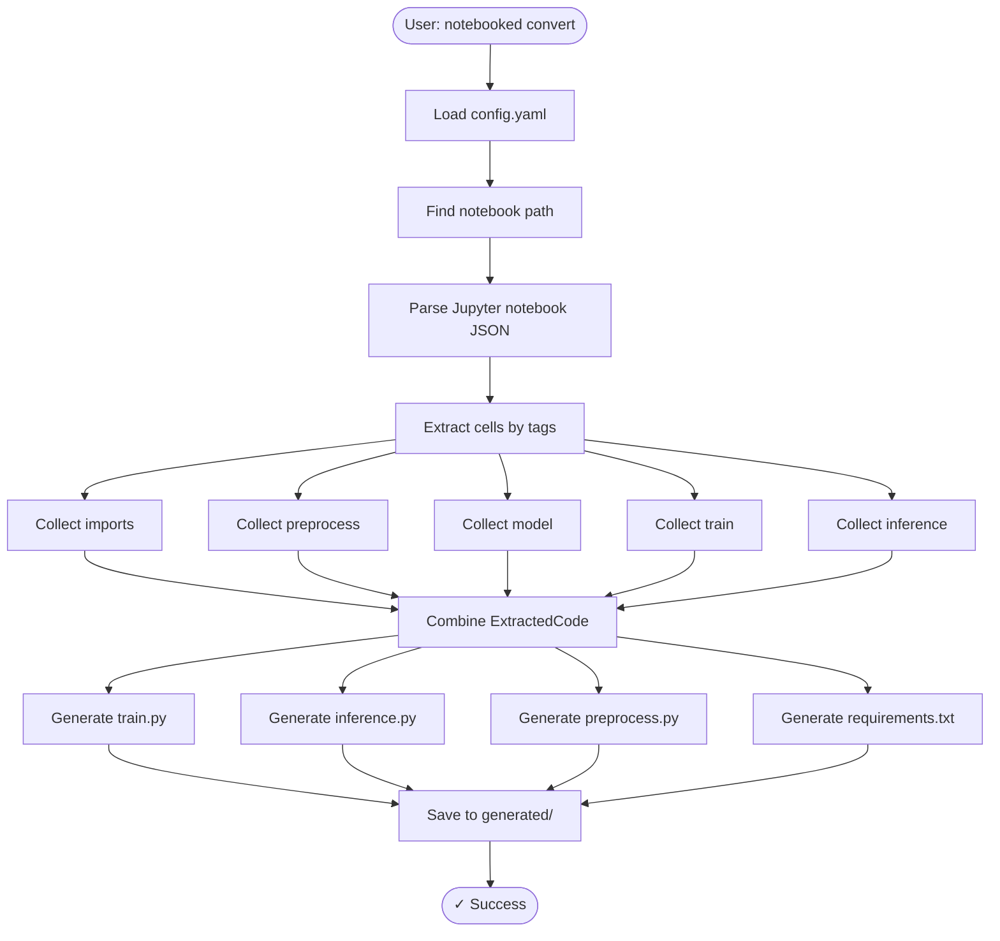

### Training Flow

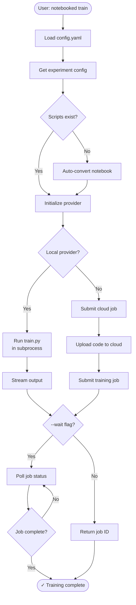

---

## Core Components

### 1. NotebookParser

**Purpose**: Extract code from tagged Jupyter notebook cells

**Key Features**:
- AST-based import detection
- Tag validation
- Magic command filtering
- Multi-cell code combination

**Algorithm**:

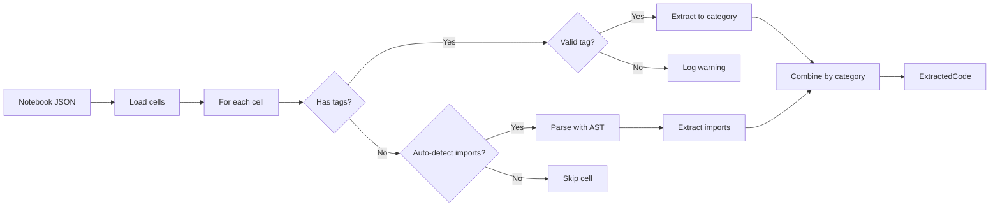

**Code Structure**:
```python
class NotebookParser:
    VALID_TAGS = {'imports', 'preprocess', 'model', 'train', 'inference', 'utils'}
    
    def parse() -> None:
        # Load notebook JSON
        # Parse cells
        
    def extract_tagged_code() -> ExtractedCode:
        # Auto-detect imports
        # Extract tagged cells
        # Filter magic commands
        # Combine code by tag
        
    def _auto_detect_imports():
        # Use AST to find import statements
        # Skip tagged cells
        
    def _filter_magic_commands():
        # Remove % and ! commands
```

### 2. CodeGenerator

**Purpose**: Generate production-ready Python scripts from extracted code

**Templates**:

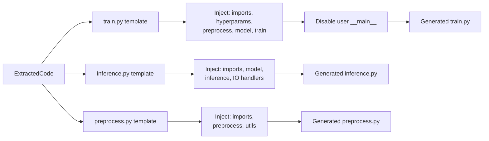

**Key Features**:
- Template-based generation
- MLFlow integration injection
- Hyperparameter configuration
- User main block disabling
- CLI argument parsing generation

**Generated Script Structure**:

```python
# train.py structure
"""
1. Header docstring
2. Standard imports (os, argparse)
3. MLFlow imports
4. User imports (from 'imports' tag)
5. Hyperparameters (from config)
6. MLFlow setup function
7. Utility functions (from 'utils' tag)
8. Preprocessing functions (from 'preprocess' tag)
9. Model classes (from 'model' tag)
10. MLFlow helper functions
11. Training code (from 'train' tag)
12. Generated main() function
13. if __name__ == "__main__": main()
"""
```

### 3. Provider System

**Design Pattern**: Strategy Pattern with Abstract Base Class

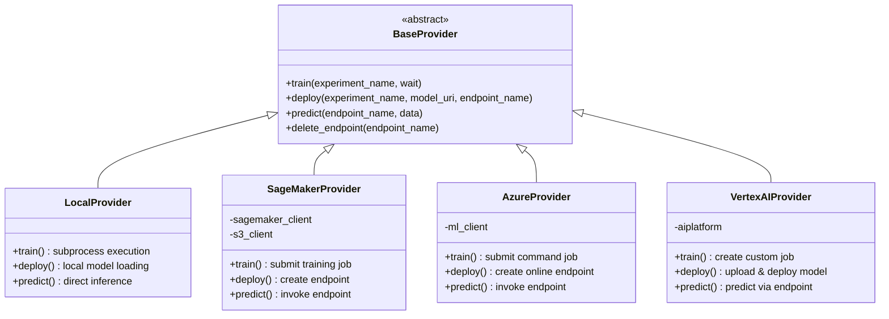

**Provider Selection**:

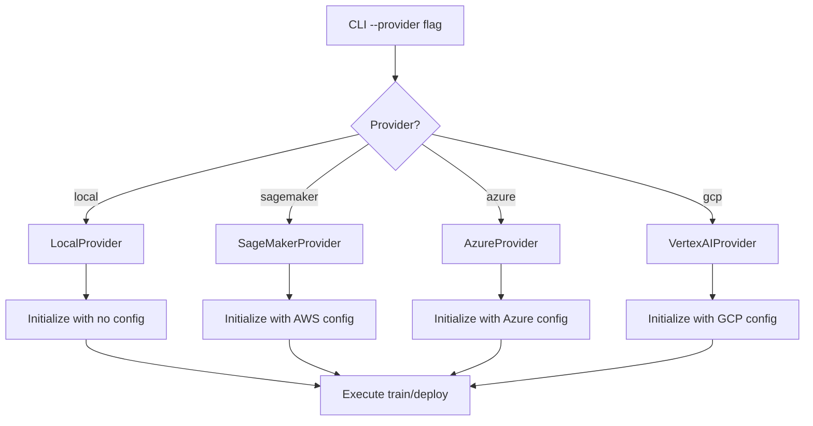

---

## Configuration Management

### Configuration Hierarchy

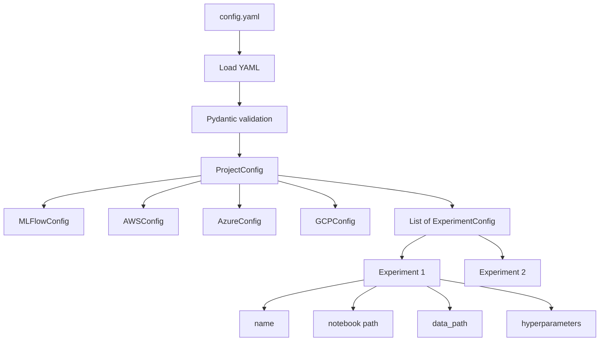

**Validation Flow**:

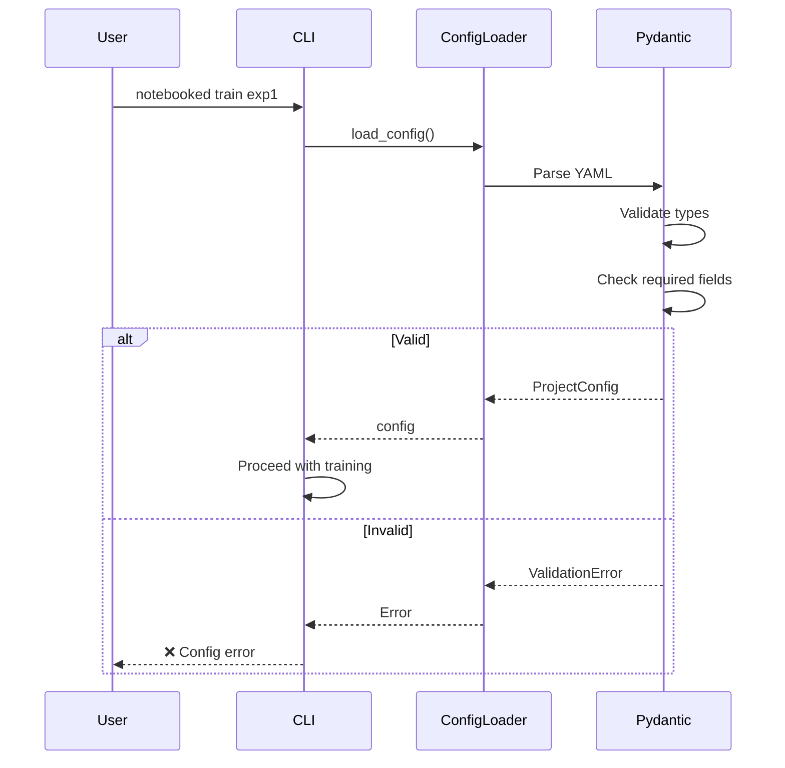

---

## Workflow Generation

### CI/CD Template Selection

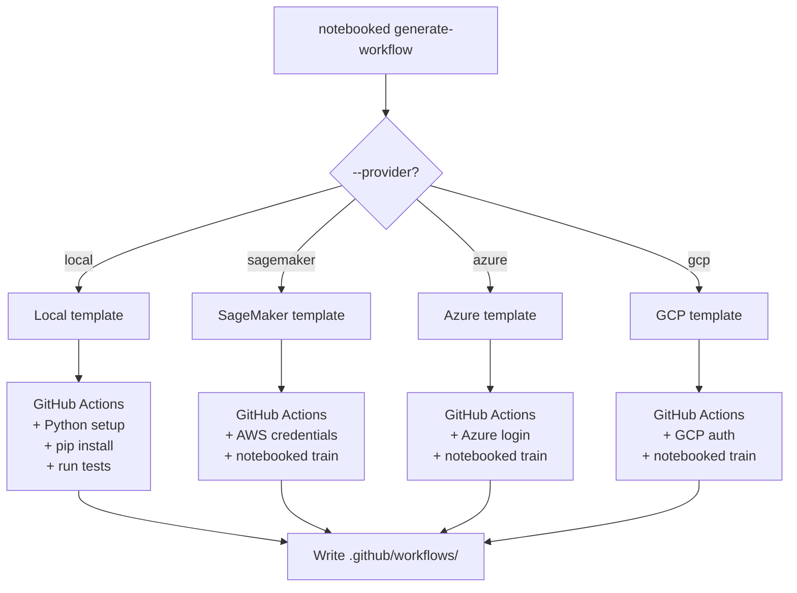

---

## Error Handling Strategy

### Error Propagation

```mermaid
flowchart TD
    ERROR[Error occurs] --> TYPE{Error type?}
    
    TYPE -->|FileNotFoundError| FILE[Specific message]
    TYPE -->|ValidationError| VALID[Config issue]
    TYPE -->|APIError| API[Cloud provider]
    TYPE -->|Other| GENERIC[Generic handler]
    
    FILE --> LOG[Log error]
    VALID --> LOG
    API --> LOG
    GENERIC --> LOG
    
    LOG --> USER[Display to user]
    USER --> EXIT[sys.exit(1)]
```

**Error Categories**:

1. **User Errors** (exit code 1):
   - Invalid configuration
   - Missing files
   - Invalid tags
   
2. **System Errors** (exit code 2):
   - Cloud provider API failures
   - Network issues
   
3. **Internal Errors** (exit code 3):
   - Unexpected exceptions
   - Logic errors

---

## Performance Considerations

### Optimization Strategies

1. **Lazy Loading**: Providers only imported when needed
2. **Caching**: Config loaded once per command
3. **Async Cloud Operations**: Optional `--no-wait` flag
4. **Minimal Dependencies**: Core has no cloud SDK dependencies

### Benchmarks

| Operation | Time | Notes |
|-----------|------|-------|
| Parse notebook | ~100ms | For 50-cell notebook |
| Generate scripts | ~50ms | 3 scripts + requirements |
| Submit SageMaker job | ~2s | Network dependent |
| Local training | Varies | Depends on model |

---

## Security Considerations

### Secrets Management

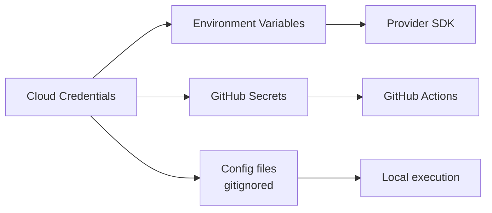

**Best Practices**:
1. Never commit `config.yaml` with real credentials
2. Use environment variables for CI/CD
3. Use cloud provider's IAM roles when possible
4. Rotate credentials regularly

---

## Extension Points

### Adding Custom Features

1. **Custom Tags**: Modify `NotebookParser.VALID_TAGS`
2. **Custom Templates**: Extend `CodeGenerator` methods
3. **Custom Providers**: Inherit from `BaseProvider`
4. **Custom Workflows**: Add templates to `WorkflowGenerator`

---

## Future Enhancements

### Planned Features

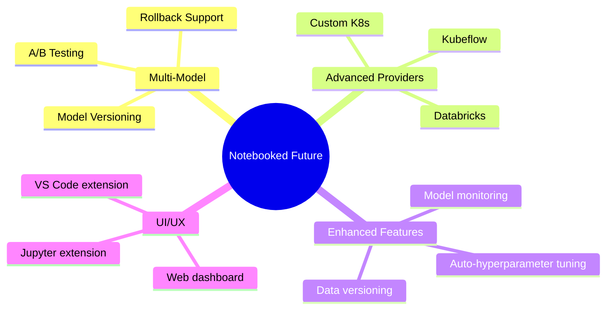

---

## Debugging Guide

### Debug Mode

Enable verbose logging:
```bash
export NOTEBOOKED_DEBUG=1
notebooked train my-exp
```

### Common Issues

1. **Duplicate Imports**: Check tag configuration
2. **Missing Model Classes**: Ensure 'model' tag is used
3. **Provider Errors**: Verify cloud credentials
4. **Generation Failures**: Check notebook structure

---

This architecture is designed to be:
- **Modular**: Each component has a single responsibility
- **Extensible**: Easy to add new providers and features
- **Testable**: Clear interfaces for mocking
- **Maintainable**: Consistent patterns throughout
